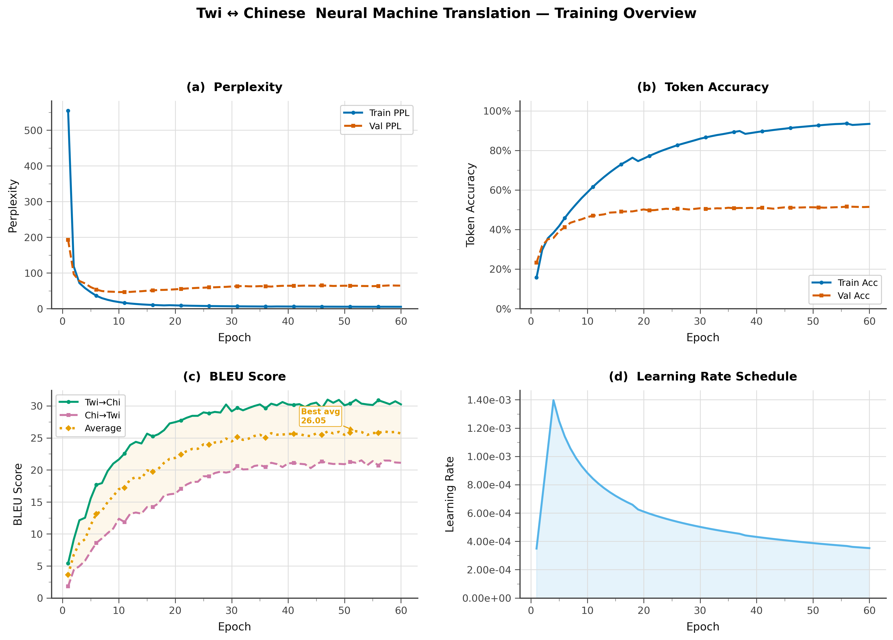
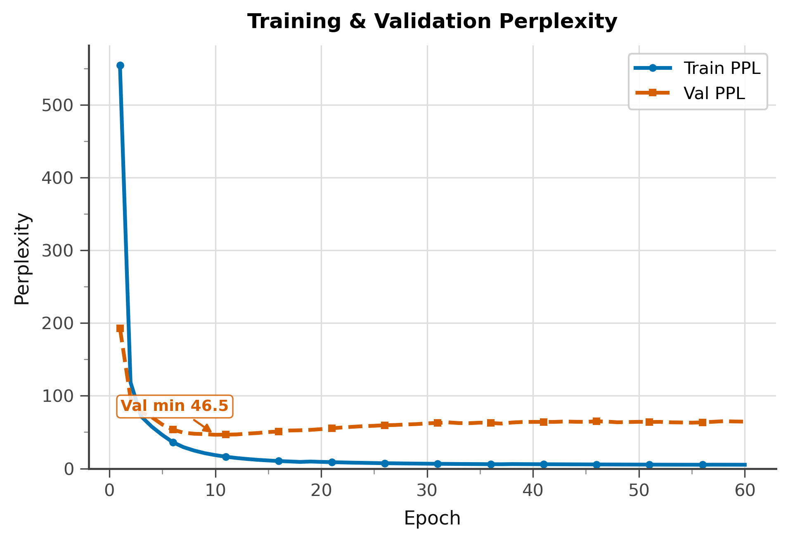
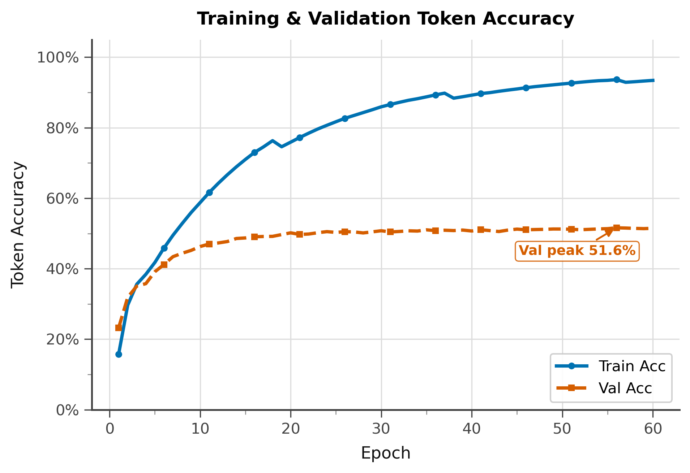
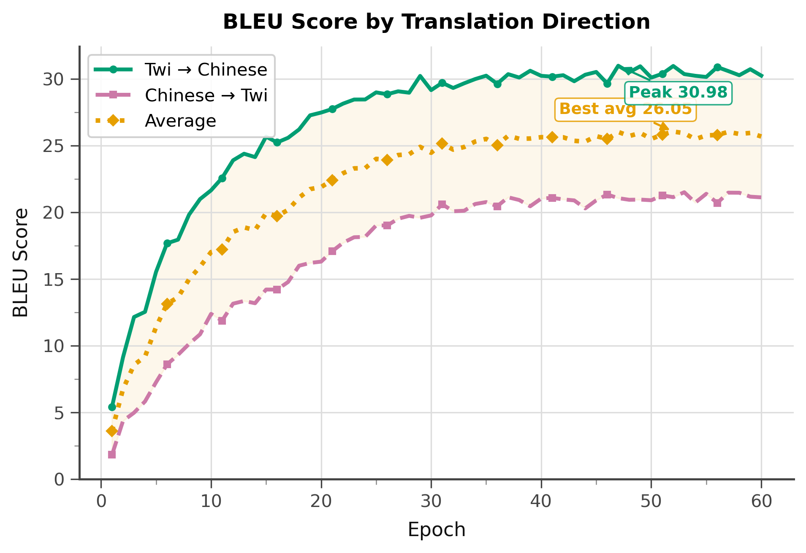
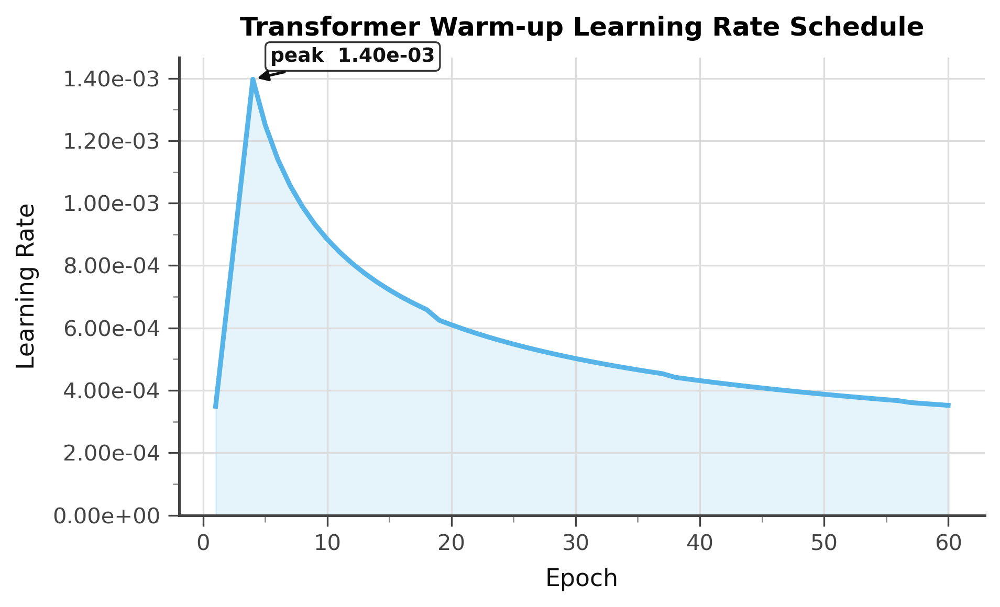

# Twi ↔ Chinese Neural Machine Translation

<div align="center">

A **bidirectional neural machine translation** system between **Twi** (Akan, Ghana) and **Mandarin Chinese** — two languages significantly underrepresented in NLP research. Built on a modernised Transformer trained as a single shared model for both directions simultaneously.

[](https://www.python.org/)
[](https://pytorch.org/)
[](https://streamlit.io/)
[](LICENSE)

</div>

---

## Live Demo

The web app is built with **Streamlit** and is ready to deploy. See the [streamlit_app/](streamlit_app/) directory.

> **Streamlit Cloud**: connect your fork at [streamlit.io/cloud](https://streamlit.io/cloud) and set the main file to `streamlit_app/app.py`.

---

## Training Results

Trained for **60 epochs** on ~41 500 parallel Twi–Chinese sentence pairs (bidirectional, ~83 000 total training examples). Model selected by best average BLEU on the validation set.

| Metric | Value |
|---|---|
| **Best Avg BLEU** (Twi↔Chi) | **26.05** (epoch 52) |
| **Best Twi → Chinese BLEU** | **30.98** (epoch 47) |
| **Best Chinese → Twi BLEU** | **21.53** (epoch 57) |
| Final Val Perplexity | 64.5 |
| Final Val Token Accuracy | 51.5% |
| Final Train Token Accuracy | 93.4% |

### Training Curves

<p align="center">
  
</p>

<details>
<summary>Individual plots</summary>

| Perplexity | Token Accuracy |
|:---:|:---:|
|  |  |

| BLEU Score | Learning Rate Schedule |
|:---:|:---:|
|  |  |

</details>

---

## Architecture

Based on *[Attention Is All You Need](https://arxiv.org/abs/1706.03762)* (Vaswani et al., 2017), with the following modernisations:

| Component | Original | This Work |
|---|---|---|
| Attention | Scaled dot-product | **Flash Attention** (`F.scaled_dot_product_attention`) |
| Position encoding | Sinusoidal (absolute) | **Rotary Position Embedding (RoPE)** |
| FFN activation | ReLU | **SwiGLU** |
| Training precision | FP32 | **Automatic Mixed Precision (AMP, FP16)** |
| Model selection | Single best checkpoint | **Checkpoint averaging** (last 8 checkpoints) |
| Gradient clipping | None | `clip_grad_norm_` (max = 1.0) |

**Configuration:** 6 layers · 8 attention heads · d_model = 512 · d_ffn = 2048 · dropout = 0.1 · label smoothing = 0.1

**Shared bidirectional vocabulary** (~9 K tokens): SentencePiece BPE for Twi + character-level for Chinese, merged into one vocab with direction tags `<2zh>` / `<2tw>`.

---

## Repository Structure

```
.
├── streamlit_app/                 # Web app — ready to deploy
│   ├── app.py                     # Entry point
│   ├── app_utils/
│   │   └── model_loader.py        # Model loading & inference
│   ├── components/
│   │   ├── sidebar.py             # Config sidebar
│   │   ├── translator.py          # Translation UI + confidence bar
│   │   └── history.py             # Session history
│   ├── nmt_core/                  # Self-contained NMT inference copy
│   ├── assets/style.css           # Custom CSS
│   ├── data/
│   │   ├── examples_twi.txt       # 500 example Twi sentences
│   │   └── examples_chi.txt       # 500 example Chinese sentences
│   ├── images/                    # Flag images
│   ├── models/                    # Place trained model files here
│   │   └── README.md              # Instructions for model files
│   ├── Dockerfile
│   ├── docker-compose.yml
│   ├── requirements.txt
│   └── run.sh
│
├── plot_metrics/                  # Publication-ready training plots (300 DPI)
│   ├── overview.png               # 2×2 combined panel
│   ├── bleu.png
│   ├── perplexity.png
│   ├── accuracy.png
│   └── lr_schedule.png
│
├── data/
│   ├── twi_chi/                   # Processed dataset
│   │   ├── val.src / val.tgt      # Validation set (500 pairs)
│   │   ├── test.src / test.tgt    # Test set — Twi→Chi (500 pairs)
│   │   ├── test_rev.src / .tgt    # Test set — Chi→Twi
│   │   ├── twi_spm.model          # SentencePiece BPE model for Twi
│   │   └── twi_spm.vocab
│   └── more_raw_twi_chinese_pairs/
│       └── twi_chinese_direct.csv # Source parallel data
│
├── model.py                       # Transformer (encoder, decoder, attention)
├── decoding.py                    # Beam search & greedy decoding
├── pad_utils.py                   # PadRemover utility
├── config.py                      # Argument parsing
├── optimizer.py                   # Warmup Adam + AMP-aware grad clipping
├── metrics.py                     # BLEU, WER, CER evaluation
├── train.py                       # Training loop + TensorBoard
├── translate.py                   # Batch translation
├── preprocess.py                  # Tokenise & serialise to .npy
├── utils.py                       # Batching, padding, statistics
├── tokenize_chinese.py            # Character-level Chinese tokeniser
├── build_dataset.py               # Build bidirectional train/val/test splits
├── build_bpe.py                   # Train & apply SentencePiece BPE
├── gui.py                         # Tkinter desktop GUI
├── plot_pub.py                    # Publication-ready metric plots
├── plot_training.py               # Interactive dark-theme training dashboard
├── pipeline.sh                    # End-to-end pipeline script
└── requirements.txt
```

---

## Installation

```bash
git clone https://github.com/uuklop/Twi_Chinese_Neural_Translation.git
cd Twi_Chinese_Neural_Translation
pip install -r requirements.txt
```

**Requirements:** Python 3.9+, PyTorch 2.0+ (CUDA recommended), SentencePiece, Matplotlib, TensorBoard.

---

## Quick Start (Training Pipeline)

Run the entire pipeline with one command:

```bash
bash pipeline.sh            # all stages
bash pipeline.sh prepare    # Step 1: build splits + BPE
bash pipeline.sh preprocess # Step 2: serialise to .npy
bash pipeline.sh train      # Step 3: train model
bash pipeline.sh translate  # Step 4: run test translation
```

Set `GPU=0` at the top of `pipeline.sh` for GPU (default) or `GPU=-1` for CPU.

---

## Step-by-Step Usage

### Step 1a — Build bidirectional data splits

```bash
python build_dataset.py
```

Creates bidirectional training set (Twi→Chi + Chi→Twi shuffled), plus held-out val/test sets (500 pairs each). Output in `data/twi_chi/`.

### Step 1b — Train SentencePiece BPE

```bash
python build_bpe.py
```

Trains BPE (vocab 4 000) on Twi; leaves Chinese as character-level.

### Step 2 — Preprocess

```bash
python preprocess.py \
    -i data/twi_chi \
    -s-train train.src  -t-train train.tgt \
    -s-valid val.src    -t-valid val.tgt \
    -s-test  test.src   -t-test  test.tgt \
    --save_data twi_chi
```

### Step 3 — Train

```bash
python train.py \
    -i data/twi_chi --data twi_chi \
    --wbatchsize 4096 --batchsize 60 \
    --tied --beam_size 5 --epoch 60 \
    --layers 6 --multi_heads 8 --warmup_steps 4000 \
    --gpu 0 --out results \
    --model_file      results/twi_chi_model.ckpt \
    --best_model_file results/twi_chi_model_best.ckpt \
    --dev_hyp         results/twi_chi_valid.out \
    --dev_hyp_rev     results/twi_chi_valid_rev.out \
    --test_hyp        results/twi_chi_test.out \
    --test_hyp_rev    results/twi_chi_test_rev.out \
    --spm_model       data/twi_chi/twi_spm.model
```

Resume training from a checkpoint:

```bash
python train.py ... --resume
```

### Step 4 — Translate

```bash
# Twi → Chinese
python translate.py -i data/twi_chi --data twi_chi \
    --batchsize 60 --beam_size 5 \
    --best_model_file results/twi_chi_model_best.ckpt \
    --model_file      results/twi_chi_model.ckpt \
    --src  data/twi_chi/test.src \
    --output results/twi_chi_pred_twi2chi.txt --gpu 0

# Chinese → Twi
python translate.py -i data/twi_chi --data twi_chi \
    --batchsize 60 --beam_size 5 \
    --best_model_file results/twi_chi_model_best.ckpt \
    --model_file      results/twi_chi_model.ckpt \
    --src  data/twi_chi/test_rev.src \
    --output results/twi_chi_pred_chi2twi.txt \
    --spm_model data/twi_chi/twi_spm.model --gpu 0
```

---

## Visualisation

### TensorBoard

```bash
tensorboard --logdir results/runs
# open http://localhost:6006
```

**Logged signals:** loss, perplexity, token accuracy, BLEU (both directions), learning rate, weight histograms, live sample translations.

### Publication-ready static plots

```bash
python plot_pub.py --metrics results/metrics.jsonl --outdir plot_metrics
```

Generates 5 PNG files at 300 DPI in `plot_metrics/`: perplexity · accuracy · BLEU · learning-rate · 2×2 overview.

---

## Streamlit Web App

The `streamlit_app/` directory is a **self-contained** deployment package that does not depend on the training directory.

### Features

- Bidirectional translation: Twi → Chinese and Chinese → Twi
- Language validation (warns if wrong script is entered)
- Confidence score bar (colour-coded: High / Medium / Low)
- 500 example sentences per language (scrollable dropdown)
- Session history with download button
- Adjustable beam size, max length, and length penalty (α)

### Local run

```bash
cd streamlit_app
pip install -r requirements.txt

# Place model files in streamlit_app/models/
#   twi_chi_model_best.ckpt   (~578 MB)
#   twi_chi.vocab.pickle       (~96 KB)
#   twi_spm.model              (~297 KB)

streamlit run app.py
# open http://localhost:8501
```

### Docker

```bash
cd streamlit_app
docker-compose up --build -d
# open http://localhost:8501
```

The `docker-compose.yml` mounts `./models` read-only into the container.
Place the three model files in `streamlit_app/models/` before running.

### Streamlit Cloud

1. Fork this repository.
2. Place model files on your server and update the `MODEL_DIR` env variable **or** use the default `streamlit_app/models/` path.
3. Connect to [Streamlit Cloud](https://streamlit.io/cloud).
4. Set the **main file path** to `streamlit_app/app.py`.

### Environment variables

| Variable | Default | Description |
|---|---|---|
| `MODEL_DIR` | `streamlit_app/models` | Directory containing model files |
| `MODEL_CKPT` | `twi_chi_model_best.ckpt` | Checkpoint filename |
| `MODEL_VOCAB` | `twi_chi.vocab.pickle` | Vocabulary filename |
| `MODEL_SPM` | `twi_spm.model` | SentencePiece model filename |

---

## Data

| Split | Pairs | Notes |
|---|---|---|
| Train | ~83 000 | Bidirectional (Twi→Chi + Chi→Twi shuffled) |
| Validation | 500 | Twi→Chi only |
| Test | 500 | Twi→Chi only; `test_rev.*` for Chi→Twi |

**Tokenisation:**
- **Twi**: SentencePiece BPE, vocab size 4 000, `character_coverage=1.0`
- **Chinese**: Character-level (one token per character)

Val and test sets are strictly disjoint from the training set.

---

## Interactive Desktop GUI

```bash
python gui.py           # auto-detect GPU
python gui.py --gpu 0   # explicit GPU
python gui.py --cpu     # force CPU
```

---

## Acknowledgements

- Transformer adapted from [DevSinghSachan/multilingual_nmt](https://github.com/DevSinghSachan/multilingual_nmt) and [Sosuke Kobayashi's Chainer implementation](https://github.com/soskek/attention_is_all_you_need).
- Evaluation utilities from [XNMT](https://github.com/neulab/xnmt) and [OpenNMT-py](https://github.com/OpenNMT/OpenNMT-py).
- Flash Attention via PyTorch 2.0 `F.scaled_dot_product_attention`.

---

*This work is part of ongoing research on neural machine translation for low-resource and underrepresented African languages.*

© trudey@uestc2025
